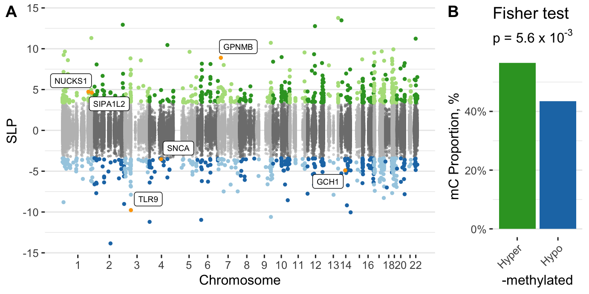

<!-- # (c)  Juozas Gordevičius -->

```{r, include=FALSE}
require(broom)
require(knitr)
require(RobustRankAggreg)
source("../code/common.R")
```

# Olfactory bulb

```{r}
ofbx <- fread("../Brain_OFB_Padlock_CGonly/www/m6_Brain_OFB_Padlock_CGonly.csv")
ofbd <- readRDS("../Brain_OFB_Padlock_CGonly/www/m6_methylation.RDS")
```

```{r, include=TRUE, results='asis'}
n <- nrow(ofbx)
glue("- Number of loci {n}")
t <- ofbd$key[, table(Group)]
glue("- Number of PD cases: {t[2]} and controls: {t[1]}")
n <- ofbx[, sum(adj.P.Val < 0.05, na.rm=TRUE)]
glue("- Number of significant loci {n}")
n <- ofbx[adj.P.Val < 0.05, length(unique(Gene))]
glue("- Number of genes affected {n}")
```


Dominant direction of methylation

```{r, include=TRUE}
t <-
	ofbx[, list(
						Significant = ifelse(adj.P.Val < 0.05, "Significant", "NS"), 
					 	Direction = ifelse(logFC < 0, "Hypo-M", "Hyper-M")
					 )] %>%
	.[, table(Significant, Direction)] %>%
	.[c("NS", "Significant"), c("Hypo-M", "Hyper-M")]

# Show the table
knitr::kable(t) %>%
kable_styling(bootstrap_options = c("hover"),
							full_width = FALSE)

# Show fisher test result
t %>% fisher.test %>% 
tidy() %>%
kable() %>%
kable_styling(bootstrap_options = c("hover"))
```

```{r}
url <- "../Brain_OFB_Padlock_CGonly/www/m6_Brain_OFB_Padlock_CGonly.csv"
stopifnot(file.exists(url))
```

- **[Additional File 4](`r url`) DNA methylation changes in the olfactory bulb of PD patients relative to controls.**


```{r, include=TRUE, fig.cap="**Figure S5. DNA methylation changes in olfactory bulb of PD patients and controls.**"}

```


# Prefrontal cortex neurons (primary cohort)

```{r}
pfcx <- fread("../Brain_PFCRep_Padlock_withGLU/www/m6_Brain_PFCRep_Padlock_withGLU.csv")
pfcd <- readRDS("../Brain_PFCRep_Padlock_withGLU/www/m6_methylation.RDS")
```

```{r, include=TRUE, results='asis'}
n <- nrow(pfcx[Type == "CG"])
glue("- Number of CpG loci {n}")
n <- nrow(pfcx[Type != "CG"])
glue("- Number of CpH loci {n}")
t <- pfcd$key[, table(Group)]
glue("- Number of PD cases: {t[2]} and controls: {t[1]}")
n <- pfcx[, sum(adj.P.Val < 0.05, na.rm=TRUE)]
glue("- Number of significant loci {n}")
n <- pfcx[adj.P.Val < 0.05, length(unique(Gene))]
glue("- Number of genes affected {n}")
```


Dominant direction of methylation

```{r, include=TRUE}
t <-
	pfcx[, list(
						Significant = ifelse(adj.P.Val < 0.05, "Significant", "NS"), 
					 	Direction = ifelse(logFC < 0, "Hypo-M", "Hyper-M")
					 )] %>%
	.[, table(Significant, Direction)] %>%
	.[c("NS", "Significant"), c("Hypo-M", "Hyper-M")]

# Show the table
knitr::kable(t) %>%
kable_styling(bootstrap_options = c("hover"),
							full_width = FALSE)

# Show fisher test result
t %>% fisher.test %>% 
tidy() %>%
kable() %>%
kable_styling(bootstrap_options = c("hover"))
```

```{r}
url <- "../Brain_PFCRep_Padlock_withGLU_Braak/www/m6_Brain_PFCRep_Padlock_withGLU_Braak.csv"
stopifnot(file.exists(url))
```

- **[Additional File 5](`r url`) DNA methylation changes in the prefrontal cortex neurons of PD patients relative to controls, primary cohort.**

```{r, include=TRUE, fig.cap="**Figure S6. DNA methylation changes in prefrontal cortex neurons of PD patients and controls.**"}
knitr::include_graphics(
	"../Brain_PFCRep_Padlock_withGLU/index_files/figure-html/unnamed-chunk-32-1.png")
```


# Overlap of appendix and brain

```{r, include=TRUE}
apx <- fread("../Appendix_PDvsControls_Padlock/www/m6_Appendix_PDvsControls_Padlock.csv")

A <- apx[ , sum(adj.P.Val < 0.05, na.rm=TRUE), list(Gene=toupper(Gene))]
B <- pfcx[ , sum(adj.P.Val < 0.05, na.rm=TRUE), list(Gene=toupper(Gene))]
C <- ofbx[ , sum(adj.P.Val < 0.05, na.rm=TRUE), list(Gene=toupper(Gene))]
```

Appendix with olfactory bulb:

```{r, include=TRUE}
t <- merge(A, C, by = "Gene") %>%  .[, table(V1.x > 0, V1.y > 0)]
f <- fisher.test(t)

# Show the table
knitr::kable(t) %>%
kable_styling(bootstrap_options = c("hover"),
							full_width = FALSE)

# Show fisher test result
f %>%
tidy() %>%
kable() %>%
kable_styling(bootstrap_options = c("hover"))
```

Appendix with prefrontal cortex neurons

```{r, include=TRUE}
t <- merge(A, B, by = "Gene") %>% .[, table(V1.x > 0, V1.y > 0)]
f <- fisher.test(t)

# Show the table
knitr::kable(t) %>%
kable_styling(bootstrap_options = c("hover"),
							full_width = FALSE)

# Show fisher test result
f %>%
tidy() %>%
kable() %>%
kable_styling(bootstrap_options = c("hover"))
```


## Prefrontal cortex neurons (large) stage-wise analysis

```{r, include=TRUE}
stagex <- fread("../Brain_PFCRep_Padlock_withGLU_Braak/www/m6_Brain_PFCRep_Padlock_withGLU_Braak.csv")
staged <- readRDS("../Brain_PFCRep_Padlock_withGLU_Braak/www/m6_methylation.RDS")
contrasts <- c(
  "StageEarly - StageControl",
  "StageLate - StageControl"
  )
```

```{r, include=TRUE, results='asis'}
t <- staged$key[PD_Braak_Stage_Group != "PD_Braak_5_6", table(Group)]
glue("- Number of PD cases: {t[2]} and controls: {t[1]}")
p <- "P.StageEarly - StageControl"
c <- "C.StageEarly - StageControl"
n <- stagex[, sum(p.adjust(get(p), "fdr") < 0.05, na.rm=TRUE)]
glue("- Number of significant loci {n}")
n <- stagex[p.adjust(get(p), "fdr") < 0.05, length(unique(Gene))]
glue("- Number of genes affected {n}")
```

Overlap of each contrast with the general result

```{r}
dt <- 
foreach(contrast = contrasts, .combine = rbind) %do% {
  colP <- paste0("P.", contrast)
  A <- pfcx[, list(ID, Significant = adj.P.Val < 0.05)]
  B <- stagex[, list(ID, Significant = p.adjust(get(colP), "fdr") < 0.05)]
  merge(A, B, by = "ID") %>%
  .[, table(Significant.x, Significant.y)] %>%
  fisher.test() %>%
  broom::tidy() %>% 
  setDT %>% 
  .[, Contrast := contrast]
}
```

```{r, include=TRUE}
dt %>%
kable %>%
kable_styling(bootstrap_options="hover")
```


```{r}
url <- "../Brain_PFCRep_Padlock_withGLU_Braak/www/m6_Brain_PFCRep_Padlock_withGLU_Braak.csv"
stopifnot(file.exists(url))
```

- **[Additional file 6](`r url`) DNA methylation changes in prefrontal cortex neurons with PD Braak stage.**


## Prefrontal cortex neurons (replication cohort)

```{r}
pfc2x <- fread("../Brain_PFC_Padlock_CGonly/www/m6_Brain_PFC_Padlock_CGonly.csv")
pfc2d <- readRDS("../Brain_PFC_Padlock_CGonly/www/m6_methylation.RDS")
```


```{r, include=TRUE, results='asis'}
n <- nrow(pfc2x)
glue("- Number of loci {n}")
t <- pfc2d$key[, table(Group)]
glue("- Number of PD cases: {t[2]} and controls: {t[1]}")
n <- pfc2x[, sum(adj.P.Val < 0.05, na.rm=TRUE)]
glue("- Number of significant loci {n}")
n <- pfc2x[adj.P.Val < 0.05, length(unique(Gene))]
glue("- Number of genes affected {n}")
```


Dominant direction of methylation

```{r, include=TRUE}
t <-
	pfc2x[, list(
						Significant = ifelse(adj.P.Val < 0.05, "Significant", "NS"), 
					 	Direction = ifelse(logFC < 0, "Hypo-M", "Hyper-M")
					 )] %>%
	.[, table(Significant, Direction)] %>%
	.[c("NS", "Significant"), c("Hypo-M", "Hyper-M")]

# Show the table
knitr::kable(t) %>%
kable_styling(bootstrap_options = c("hover"),
							full_width = FALSE)

# Show fisher test result
t %>% fisher.test %>% 
tidy() %>%
kable() %>%
kable_styling(bootstrap_options = c("hover"))
```

Overlap of differentially methylated ALP genes in PFC replicate cohort and apppendix

```{r, include=TRUE}
A <- apx[ , sum(adj.P.Val < 0.05, na.rm=TRUE), list(Gene=toupper(Gene))]
D <- pfc2x[ , sum(adj.P.Val < 0.05, na.rm=TRUE), list(Gene=toupper(Gene))]


t <- merge(A, D, by = "Gene") %>% .[, table(V1.x > 0, V1.y > 0)] 
f <- fisher.test(t)

# Show the table
knitr::kable(t) %>%
kable_styling(bootstrap_options = c("hover"),
							full_width = FALSE)

# Show fisher test result
f %>%
tidy() %>%
kable() %>%
kable_styling(bootstrap_options = c("hover"))
```

```{r}
url <- "../Brain_PFC_Padlock_CGonly/www/m6_Brain_PFC_Padlock_CGonly.csv"
stopifnot(file.exists(url))
```

- **[Additional file 7](`r url`) DNA methylation changes in the prefrontal cortex neurons of PD patients relative to controls, replication cohort.**

# Hallmarks of PD

```{r}


computeORs <- function(dt, cores = parallel::detectCores()) {
	require(doParallel)
	registerDoParallel(cores = cores)
  dt <- 
    foreach (gene = unique(dt$Gene), .combine = rbind) %dopar% {
      require(data.table)
      tryCatch({
        t <- dt[, table(Gene == gene, Significant == TRUE)]
        f <- fisher.test(t, alternative = "greater")
        data.table(OR = f$estimate, P = f$p.value, Gene = gene)    
      }, error = function(e) {
        message(e)
        data.table(OR = NA, P = NA, Gene = gene)
      })
    }
  dt
}

epfcr <- cache(foo=computeORs, fname="epfcr.RDS", 
               dt = pfc2x[, list(Gene, Significant = adj.P.Val < 0.05)])
epfc  <- cache(foo=computeORs, fname="epfc.RDS",
               dt = pfcx[, list(Gene, Significant = adj.P.Val < 0.05)])
eofb  <- cache(foo=computeORs, fname="eofb.RDS",
               dt = ofbx[, list(Gene, Significant = adj.P.Val < 0.05)])
eapp  <- cache(foo=computeORs, fname="eapp.RDS",
               dt = apx[, list(Gene, Significant = adj.P.Val < 0.05)])
hallmarks <- aggregateRanks(
  list(
    # epfcr[order(P), Gene],
    epfc[order(P), Gene],
    eofb[order(P), Gene],
    eapp[order(P), Gene]
  )
)  
setDT(hallmarks)
setnames(hallmarks, "Name", "Gene")
hallmarks <- 
merge(hallmarks, epfcr[, list(Gene, PFCII.OR=OR, PFCII.P=P)], by = "Gene") %>% 
		merge(., epfc[, list(Gene, PFC.OR=OR, PFC.P=P)], by = "Gene") %>%
		merge(., eofb[, list(Gene, OFB.OR=OR, OFB.P=P)], by = "Gene") %>%
		merge(., eapp[, list(Gene, APP.OR=OR, APP.P=P)], by = "Gene")

if (!dir.exists("www")) dir.create("www")
write.table(hallmarks[order(Score)], file = "www/PD_Hallmarks.csv", sep = ",", row.names = FALSE)

```

```{r, include=TRUE}
hallmarks[order(Score)][1:40] %>%
kable %>%
kable_styling(bootstrap_options="hover")
```

```{r}
url <- "./www/PD_Hallmarks.csv"
stopifnot(file.exists(url))
```

- **[Additional file 8](`r url`) ALP genes consistently epigenetically disrupted across the PD appendix and brain.**

