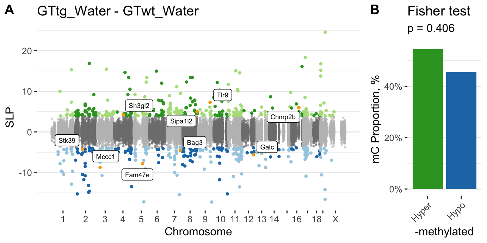
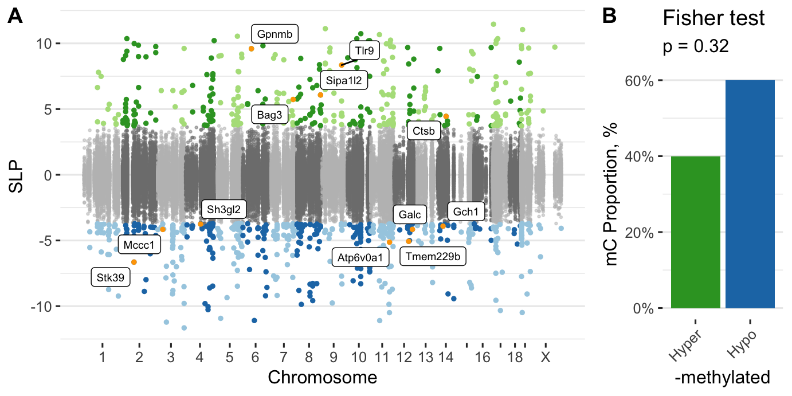

<!-- # (c)  Juozas Gordevičius -->

```{r, include=FALSE}
require(broom)
source("../code/common.R")
source("../code/pformat.R")

gmap <- fread("../etc/padlock_genes_human2mouse.csv") %>%
  select(V1, V2)
gmap[1, ] %>% as.character %>% setnames(gmap, .)
gmap <- gmap[-1,]
```

```{r}
cpx <- fread("../Mice_CecalPatch_Padlock/www/m6_Mice_CecalPatch_Padlock.csv")
dssx <- fread("../Mice_DSS_Padlock/www/m6_Mice_DSS_Padlock.csv")
apx <- fread("../Appendix_PDvsControls_Padlock/www/m6_Appendix_PDvsControls_Padlock.csv")
```

# DSS

```{r, include=TRUE, results='asis'}
n <- nrow(dssx)
glue("- Number of loci {n}")

# In WT
colP <- "P.GTwt_DSS - GTwt_Water"
n <- dssx[, sum(p.adjust(get(colP), "fdr") < 0.05, na.rm=TRUE)]
glue("- Number of significant loci in WT DSS vs Water {n}")
n <- dssx[p.adjust(get(colP), "fdr") < 0.05, length(unique(Gene))]
glue("- Number of affected genes in WT {n}")

# In A30P
colP <- "P.GTtg_DSS - GTtg_Water"
n <- dssx[, sum(p.adjust(get(colP), "fdr") < 0.05, na.rm=TRUE)]
glue("- Number of significant loci in A30P DSS vs Water {n}")
n <- dssx[p.adjust(get(colP), "fdr") < 0.05, length(unique(Gene))]
glue("- Number of affected genes in A30P {n}")
```

Dominant direction of methylation in WT

```{r, include=TRUE}
colP <- "P.GTwt_DSS - GTwt_Water"
colC <- "C.GTwt_DSS - GTwt_Water"
t <- 
	dssx[, table(ifelse(p.adjust(get(colP), "fdr") < 0.05, "Significant", "NS"),
							 ifelse(get(colC) > 0, "Hyper-M", "Hypo-M"))] %>%
	.[c("NS", "Significant"), c("Hypo-M", "Hyper-M")]
f <- fisher.test(t)

# Show the table
knitr::kable(t) %>%
kable_styling(bootstrap_options = c("hover"),
							full_width = FALSE)

# Show fisher test result
t %>% fisher.test %>% 
broom::tidy() %>%
knitr::kable() %>%
kable_styling(bootstrap_options = c("hover"))
```

Dominant direction of methylation in A30P

```{r, include=TRUE}
colP <- "P.GTtg_DSS - GTtg_Water"
colC <- "C.GTtg_DSS - GTtg_Water"
t <- 
	dssx[, table(ifelse(p.adjust(get(colP), "fdr") < 0.05, "Significant", "NS"),
							 ifelse(get(colC) > 0, "Hyper-M", "Hypo-M"))] %>%
	.[c("NS", "Significant"), c("Hypo-M", "Hyper-M")]
f <- fisher.test(t)

# Show the table
knitr::kable(t) %>%
kable_styling(bootstrap_options = c("hover"),
							full_width = FALSE)

# Show fisher test result
t %>% fisher.test %>% 
broom::tidy() %>%
knitr::kable() %>%
kable_styling(bootstrap_options = c("hover"))
```


```{r, include=TRUE, fig.cap="**Figure S12. Differential methylation of the ALP in the cecal patch of A30P α-syn mice.**"}

```

```{r}
url <- "../Mice_DSS_Padlock/www/m6_Mice_DSS_Padlock.csv"
stopifnot(file.exists(url))
```

- **[Additional file 14](`r url`) DNA methylation changes in the cecal patch in response to gut inflammation: wild-type and A30P $\alpha$-syn mice chronically treated with DSS or water.**


# rAAV-$\alpha$-syn model


```{r, include=TRUE, results='asis'}
n <- nrow(cpx)
glue("- Number of loci {n}")
n <- cpx[, sum(adj.P.Val < 0.05, na.rm=TRUE)]
glue("- Number of significant loci {n}")
n <- cpx[adj.P.Val < 0.05, length(unique(Gene))]
glue("- Number of genes affected {n}")
```


```{r, include=TRUE, fig.cap="**Figure S14. Differential methylation of the ALP in the cecal patch of mice with a-syn aggregation. **"}

```

```{r}
url <- "../Mice_CecalPatch_Padlock/www/m6_Mice_CecalPatch_Padlock.csv"
stopifnot(file.exists(url))
```

- **[Additional file 15](`r url`) DNA methylation changes in the cecal patch induced by rAAV vector-mediated $\alpha$-syn aggregation in mice.**


# Correlation of gene enrichments in cecal patch and DSS mice


```{r}
# Compute enrichment of genes in mice data
computeORs <- function(dt) {
	require(doParallel)
	registerDoParallel(cores = parallel::detectCores())
  dt <- 
    foreach (gene = unique(dt$Gene), .combine = rbind) %dopar% {
      require(data.table)
      tryCatch({
        t <- dt[, table(Gene == gene, Significant == TRUE)]
        f <- fisher.test(t, alternative = "greater")
        data.table(OR = f$estimate, P = f$p.value, 
                   N=dt[Gene == gene & Significant == TRUE, .N], 
                   Gene = gene)    
      }, error = function(e) {
        message(e)
        data.table(OR = NA, P = NA, 
                   N = dt[Gene == gene & Significant == TRUE, .N], 
                   Gene = gene)
      })
    }
  dt
}

# touch()
ecp <- cache(foo=computeORs, fname="ecp.RDS",
             dt=cpx[, list(Gene, Significant = adj.P.Val < 0.05)])
setnames(ecp, c("OR", "P", "N"), paste0(c("OR.", "P.", "N."), "CP"))

myContrasts <- c(
  "GTwt_DSS - GTwt_Water",
  "GTtg_DSS - GTwt_Water",
  "GTtg_DSS - GTtg_Water",
  "GTtg_Water - GTwt_Water")

edss <- foreach( cont = myContrasts) %do% {
	colP <- paste0("P.", cont)
	# touch()
	e <- cache(foo=computeORs, fname=glue("edss_{cont}.RDS"),
	           dt = dssx[, list(Gene, 
	                            Significant = p.adjust(get(colP), "fdr") < 0.05)])
	setnames(e, c("OR", "P", "N"), paste0(c("OR.", "P.", "N."), cont))
	e
}
names(edss) <- myContrasts


dt <- foreach(cont = myContrasts, .combine=rbind) %do% {
	orname <- paste0("OR.", cont)
	nname <- paste0("N.", cont)
  X <- merge(ecp, edss[[cont]], by = "Gene")
  
  res <- 
  	X %>%
	  .[OR.CP > 0 & get(orname) > 0] %>%
	  .[, cor.test(log(OR.CP), log(get(orname)), method="kendall")] %>%
	  tidy

	overlap <- X[ N.CP > 0 & get(nname) > 0, .N]
	res %>% 
	mutate(overlap = overlap) %>%
	mutate(Contrast = cont)
}

fwrite(dt, "ORs_CecalPatch_DSS.csv")	  
```


```{r, include=TRUE}
dt %>%
mutate(p_star = gtools::stars.pval(p.value)) %>%
mutate(p_star = texPstars(p_star)) %>%
kable %>% 
kable_styling(bootstrap_options="hover")
```

# Correlation of gene enrichments in mice and PD appendix

```{r}

# compute odds ratios 
# touch()
eapx <- cache(foo=computeORs, fname="eapx.RDS",
              dt=apx[, list(Gene, Significant = adj.P.Val < 0.05)])
eapx <- merge(eapx, gmap, by.x = "Gene", by.y = "HGNC_hg19")
eapx <- eapx[, list(OR, P, N, Gene = MGI_mm10)]
eapx <- eapx[!duplicated(Gene)]

# Correlate to mice DSS
dt <- 
  foreach(cont = myContrasts, .combine=rbind) %do% {
		orname <- paste0("OR.", cont)
		nname <- paste0("N.", cont)
	  X <- merge(eapx, edss[[cont]], by = "Gene")

		res <- 
			X %>%
		  .[OR > 0 & get(orname) > 0] %>%
		  .[, cor.test(log(OR), log(get(orname)), method="kendall")] %>%
		  tidy

		overlap <- X[ N > 0 & get(nname) > 0, .N]
		res %>% 
		mutate(overlap = overlap) %>%
		mutate(Contrast = cont)
  }

# Corerlate to mice CP
X <- merge(eapx, ecp, by = "Gene")
overlap = X[ N > 0 & N.CP > 0, .N]
dt2 <- 
   X[OR > 0 & OR.CP > 0] %>%
    .[, cor.test(log(OR), log(OR.CP), method="kendall")] %>% 
    tidy() %>%
    mutate(overlap = overlap) %>%
    mutate(Contrast = "Cecal patch")


dt <- rbind(dt, dt2)
rm(dt2)
fwrite(dt, file = "ORs_Appendix_Mice.csv")
```

```{r, include=TRUE}
dt %>%
mutate(p_star = gtools::stars.pval(p.value)) %>%
mutate(p_star = texPstars(p_star)) %>%
kable %>% 
kable_styling(bootstrap_options="hover")
```

# Enrichment of ALP pathways

```{r}
pathways_mouse <- readRDS("../Discover_Pathways/mousePathways.RDS")
pathways_human <- readRDS("../Discover_Pathways/humanPathways.RDS")

# Table that stores the count of the number of DMCs in each gene
dt <- apx[, list(APX = sum(adj.P.Val < 0.05, na.rm=TRUE)), Gene]
dt <- merge(dt, gmap, by.x = "Gene", by.y = "HGNC_hg19") 
dt <- dt[, list(Gene_Mouse = MGI_mm10, Gene_Human=Gene, APX)]
dt <- merge(
  dt,
  cpx[, list(CecalPatch = sum(adj.P.Val < 0.05, na.rm=TRUE)), Gene], 
  by.x = "Gene_Mouse", by.y = "Gene")
foreach (contrast = myContrasts) %do% {
  colP <- glue("P.{contrast}")
  colC <- glue("C.{contrast}")

  dt <- 
    dssx[, list(C = sum(p.adjust(get(colP), "fdr") < 0.05, na.rm=TRUE)), Gene] %>%
    setnames(., "C", contrast) %>%
    merge(dt, ., by.x = "Gene_Mouse", by.y = "Gene")
  return(NULL)
}

```


```{r}
# Take the genes that have more than 1 DMCs in both appendix and mouse dataset and test which pathways are enriched.
res <- 
  foreach( p = pathways_human, .combine = rbind) %do% {
    genes <- p$genes

    res1 <- dt[, table(APX > 1 & CecalPatch > 1, Gene_Human %in% genes)] %>%
            fisher.test %>%
            broom::tidy() %>% 
            select(estimate, p.value, conf.low, conf.high) %>%
            setDT %>%
            .[, Test := sprintf('rAAV \u03B1-syn')] %>%
            .[, Pathway := p$name]
    res2 <- dt[, table(APX > 1 & `GTtg_DSS - GTtg_Water` > 1, Gene_Human %in% genes)] %>%
            fisher.test %>%
            broom::tidy() %>% 
            select(estimate, p.value, conf.low, conf.high) %>%
            setDT %>%
            .[, Test := "A30P_DSS - A30P_Water"] %>%
            .[, Pathway := p$name]
    res3 <- dt[, table(APX > 1 & `GTwt_DSS - GTwt_Water` > 1, Gene_Human %in% genes)] %>%
            fisher.test %>%
            broom::tidy() %>% 
            select(estimate, p.value, conf.low, conf.high) %>%
            setDT %>%
            .[, Test := "WT_DSS - WT_Water"] %>%
            .[, Pathway := p$name]
    res4 <- dt[, table(APX > 1 & `GTtg_DSS - GTwt_Water` > 1, Gene_Human %in% genes)] %>%
            fisher.test %>%
            broom::tidy() %>% 
            select(estimate, p.value, conf.low, conf.high) %>%
            setDT %>%
            .[, Test := "A30P_DSS - WT_Water"] %>%
            .[, Pathway := p$name]
           
    res5 <- dt[, table(APX > 1 & `GTtg_Water - GTwt_Water` > 1, Gene_Human %in% genes)] %>%
            fisher.test %>%
            broom::tidy() %>% 
            select(estimate, p.value, conf.low, conf.high) %>%
            setDT %>%
            .[, Test := "A30P_Water - WT_Water"] %>%
            .[, Pathway := p$name]
    rbindlist(list(res1, res2, res3, res4, res5))
  }

```

```{r}
# Take the genes that have more than 1 DMC in both cecal patch experiment and other DSS contrast and test which pathways are enriched.
res2 <-
  foreach( p = pathways_mouse, .combine = rbind) %do% {
    genes <- p$genes

    res2 <- dt[, table(CecalPatch > 1 & `GTtg_DSS - GTtg_Water` > 1, Gene_Mouse %in% genes)] %>%
            fisher.test %>%
            broom::tidy() %>% 
            select(estimate, p.value, conf.low, conf.high) %>%
            setDT %>%
            .[, Test := sprintf("A30P_DSS - A30P_Water")] %>%
            .[, Pathway := p$name]
    res3 <- dt[, table(CecalPatch > 1 & `GTwt_DSS - GTwt_Water` > 1, Gene_Mouse %in% genes)] %>%
            fisher.test %>%
            broom::tidy() %>% 
            select(estimate, p.value, conf.low, conf.high) %>%
            setDT %>%
            .[, Test := sprintf("WT_DSS - WT_Water")] %>%
            .[, Pathway := p$name]
    res4 <- dt[, table(CecalPatch > 1 & `GTtg_DSS - GTwt_Water` > 1, Gene_Mouse %in% genes)] %>%
            fisher.test %>%
            broom::tidy() %>% 
            select(estimate, p.value, conf.low, conf.high) %>%
            setDT %>%
            .[, Test := sprintf("A30P_DSS - WT_Water")] %>%
            .[, Pathway := p$name]
           
    res5 <- dt[, table(CecalPatch > 1 & `GTtg_Water - GTwt_Water` > 1, Gene_Mouse %in% genes)] %>%
            fisher.test %>%
            broom::tidy() %>% 
            select(estimate, p.value, conf.low, conf.high) %>%
            setDT %>%
            .[, Test := sprintf("A30P_Water - WT_Water")] %>%
            .[, Pathway := p$name]
    rbindlist(list(res2, res3, res4, res5))
  }

```


```{r}
res[, Study := "PD appendix vs mice studies"]
res2[, Study := sprintf("rAAV-\u03B1-syn vs\nDSS study")]
pd <- rbind(res, res2)

p1 <- ggplot(pd, aes(Pathway, log(estimate), color = p.value < 0.05, shape = Test)) + 
      geom_jitter(size = 3, width = 0.2) + 
      geom_hline(yintercept = 0) + 
      ylab("OR, log") + 
      facet_wrap(~ Study) + 
      scale_shape_discrete("") + 
      scale_color_manual("p", values = c("grey30", "red"), labels = c("> 0.05", "< 0.05")) + 
      theme_bw(base_size = 14) + 
      theme(
        axis.title.x = element_blank(),
        axis.text.x = element_text(angle = 45, hjust = 1))

```

```{r, include=TRUE, fig.cap="**Figure S15. ALP pathway changes in the PD appendix compared to the mouse studies.**"}
p1
```
